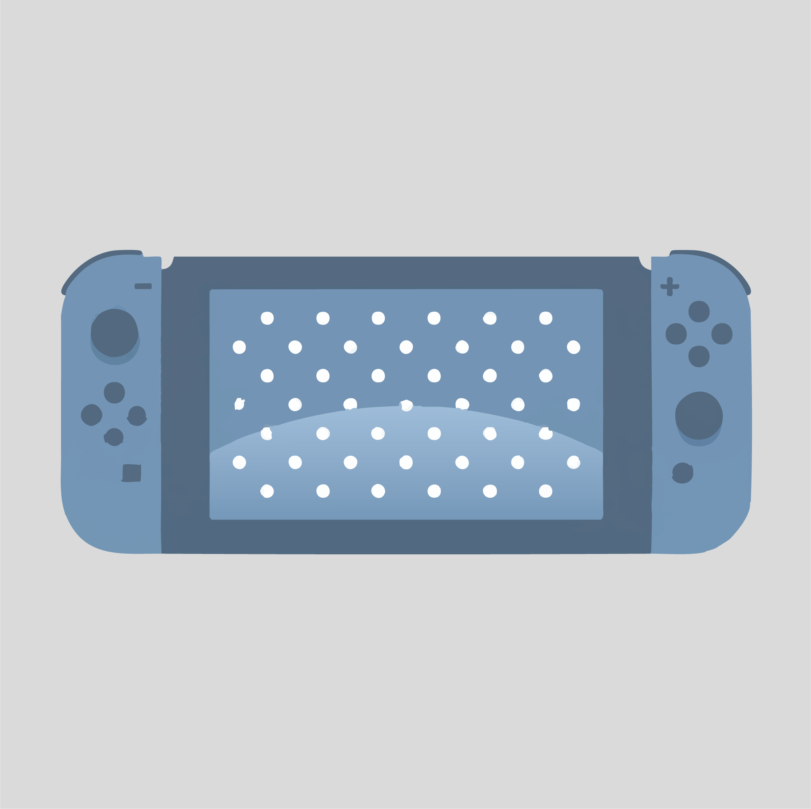
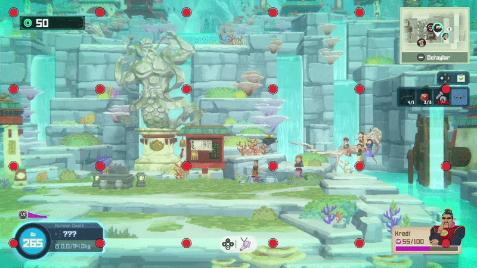
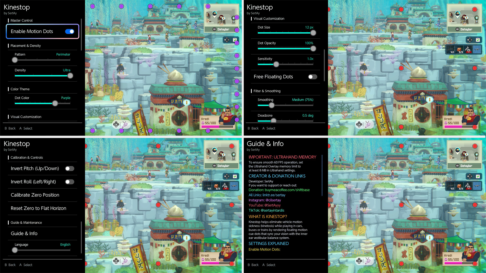
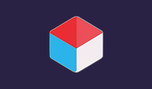
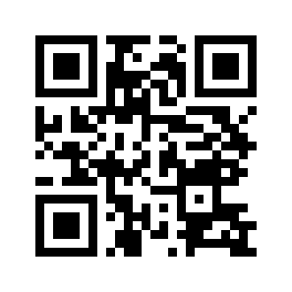
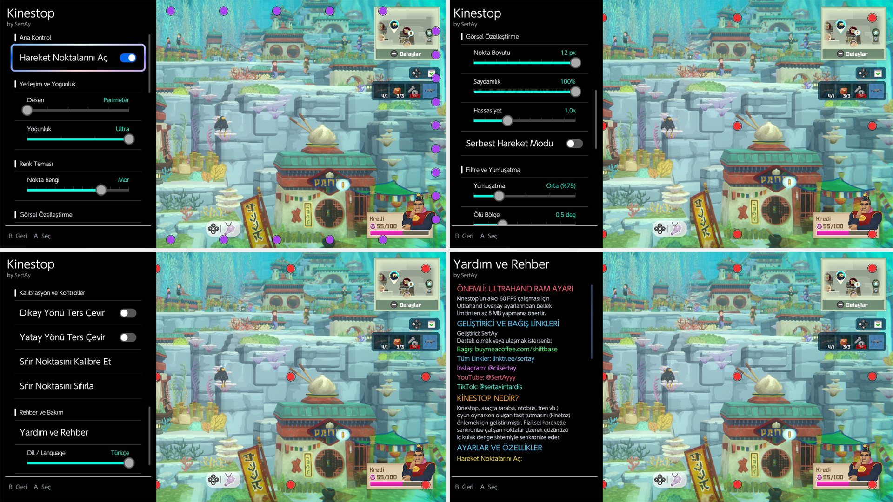

<h1 align="center">Kinestop </h1>

  

  ---
    
  

  <b>(EN)</b> Kinestop is an anti-motion sickness (kinetosis) overlay for the Nintendo Switch. It renders smooth 60 FPS floating motion cues synchronized with the console's hardware sensors, preventing nausea while playing in cars, buses, and trains.

  ---

  <b>(TR)</b> Kinestop, Nintendo Switch için araç tutmasını (kinetoz) önleyen bir hareket takip aracıdır. Konsolun donanım sensörleriyle senkronize 60 FPS hareket noktaları çizerek, araba, otobüs veya trende oyun oynarken oluşan mide bulantısını engeller.
  

  

 &nbsp;&nbsp; 

---

## (EN) Setup and Usage Guide

### ✨ Features
* **Prevents Motion Sickness:** 60 FPS floating motion cues sync with physical movement to eliminate nausea.
* **Universal Compatibility:** Works across all games and the Switch Home Menu.
* **Free Floating Mode:** Dots can drift naturally beyond screen edges for an authentic horizon view.
* **Visual Customization:** 12 color themes, 6 placement patterns, dot size, and opacity options.
* **Adjustable Sensitivity:** 10 sensitivity levels (0.2x - 6.0x) with hand tremor smoothing.
* **Zero Calibration:** Lock your current holding angle as the center horizon with one click.
* **Language Support:** English and Turkish language support.

  

### ⚠️ Step 1: Critical Prep (Required)
To prevent your console from crashing, you must increase the **UltraHand memory limit**:
1. Open the UltraHand menu.
2. Press `+` to open settings, then go to **System**.
3. Change **Overlay Memory** from **4MB to 8MB**.

### 💾 Step 2: Installation
**Requirements:** You MUST have [nx-ovlloader](https://github.com/ppkantorski/nx-ovlloader) and [Ultrahand-Overlay](https://github.com/ppkantorski/Ultrahand-Overlay) installed for this app to work!

**Method 1: Homebrew App Store (Automatic Installation)**
You can download and install the application directly on your Switch via the HB App Store.

   <a href="https://hb-app.store/switch/Kinestop">
  
   
  <a href="https://apps.fortheusers.org/switch/Kinestop">HB Store Download Link</a>

 

**Method 2: Manual Installation**
You can install the application by downloading it on your computer and transferring it to your SD card.
* Download the [latest release](https://github.com/sertay1/Kinestop/releases) `.zip` file. Extract it and drag all the contents directly to the root of your SD card. The files are already placed in their correct folder paths (`SD:/switch/.overlays/kinestop.ovl` and `SD:/config/kinestop/config.ini`).

### 🎮 Step 3: How to Use
1. **Open UltraHand:** While in-game, swipe from the left edge or press **L + R + D-Pad Down + Right Stick**.
2. **Launch Kinestop:** Select Kinestop from the overlay list.
3. **Configure:** Turn on motion dots, choose your preferred color, style, and sensitivity.
4. **Play:** Press **(B)** in the menu to return to your game while the motion dots float over gameplay.

---

## 🔗 Contact and Donate

### SertAy

| Links | QR Code |
| :--- | :--- |
| **All Links:** [My Linktree](https://linktr.ee/yamanx) |  |

---

## (TR) Kurulum ve Kullanım Rehberi

### ✨ Özellikler
* **Taşıt Tutmasını Önleme:** Fiziksel hareketle senkronize 60 FPS hareket noktalarıyla mide bulantısını engeller.
* **Tüm Oyunlarla Uyumlu:** Bütün oyunlarda ve Switch Ana Menüsünde çalışır.
* **Serbest Hareket Modu:** Noktaların pencereden bakar gibi ekran dışına doğal süzülmesini sağlar.
* **Görsel Kişiselleştirme:** 12 renk teması, 6 yerleşim şablonu, boyut ve saydamlık seçenekleri.
* **Hassasiyet Ayarı:** 10 kademeli hassasiyet (0.2x - 6.0x) ve el titremesini filtreleme desteği.
* **Sıfır Noktası Kalibrasyonu:** Konsolu tuttuğunuz açıyı tek tuşla merkez ufuk seviyesi yapar.
* **Dil Desteği:** Türkçe ve İngilizce dil desteği.

  

### ⚠️ 1. Aşama: Kritik Ön Hazırlık (Zorunlu)
Cihazın çökmesini (crash) önlemek için **UltraHand bellek ayarını** değiştirmeniz şarttır:
1. UltraHand menüsünü açın.
2. `+` tuşuna basarak ayarlara, ardından **System** bölümüne girin.
3. **Overlay Memory** değerini **4MB'den 8MB'a** yükseltin.

### 💾 2. Aşama: Kurulum
**Zorunlu Gereksinimler:** Uygulamanın çalışması için cihazınızda [nx-ovlloader](https://github.com/ppkantorski/nx-ovlloader) ve [Ultrahand-Overlay](https://github.com/ppkantorski/Ultrahand-Overlay) yüklü olmak ZORUNDADIR!

**Yöntem 1: Homebrew App Store (Otomatik Kurulum)**
Uygulamayı doğrudan Switch üzerinden HB App Store aracılığıyla indirip kurabilirsiniz.

   <a href="https://hb-app.store/switch/Kinestop">
  
   
  <a href="https://apps.fortheusers.org/switch/Kinestop">HB Store İndirme Linki</a>

 

**Yöntem 2: Manuel Kurulum**
Uygulamayı bilgisayarınıza indirip SD kartınıza atarak kurabilirsiniz.
* İndirdiğiniz [en güncel sürüm](https://github.com/sertay1/Kinestop/releases) `.zip` dosyasını bilgisayara çıkartın. Çıkan tüm dosyaları doğrudan SD kartınızın ana dizinine sürükleyip bırakın (`SD:/switch/.overlays/kinestop.ovl` ve `SD:/config/kinestop/config.ini`).

### 🎮 3. Aşama: Uygulamanın Kullanımı
1. **UltraHand'i Açın:** Ekranın sol kenarından sağa kaydırarak veya **L + R + D-Pad Aşağı + Sağ Analog** kısayoluyla UltraHand'i açın.
2. **Kinestop'u Başlatın:** Listeden Kinestop'u seçin.
3. **Ayarlayın:** Hareket noktalarını açın, istediğiniz rengi, yerleşim şablonunu ve hassasiyeti belirleyin.
4. **Oyuna Dönün:** **(B)** tuşuna basarak oyuna dönün; noktalar oyun ekranının üstünde akmaya devam edecektir.

---

## 🔗 İletişim ve Bağış

### SertAy

| Linkler | QR Kod |
| :--- | :--- |
| **Tüm Linkler:** [Linktree Sayfam](https://linktr.ee/yamanx) |  |

---

## 📄 License / Lisans

Tüm hakları saklıdır (All Rights Reserved) — © 2026 SertAy.  
Bu projenin kodlarının kopyalanması, üzerinde değişiklik yapılması veya izinsiz dağıtılması yasaktır. Lütfen LICENSE dosyasını inceleyiniz.

Copying, modifying, or unauthorized distribution of the code is strictly prohibited. Please see the LICENSE file for details.
